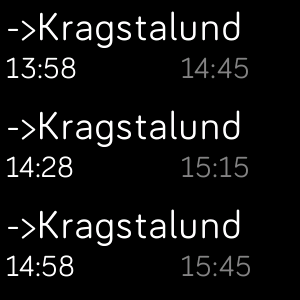

# Stockholm Local Transport

Based on the Fitbit SDK [example application BART](https://github.com/Fitbit/sdk-bart).
Allows you to set your favorite two destinations and shows you next departures between them or between your location and one of them. The destination is based on the time of day.

This app is based on information retrieved from [Trafiklab.se](http://www.trafiklab.se).

Project for the app on Trafiklab: https://www.trafiklab.se/projekt/stockholm-local-transport-fitbit

## License

Licensed under the [MIT License](./LICENSE).

Icons: Train by Evgeni Moryakov from the [Noun Project](thenounproject.com).
